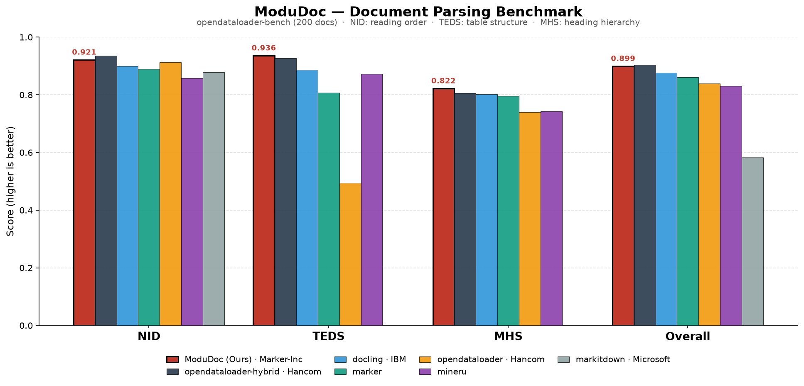

# 👁️ ModuDoc: VLM-Powered Document Parser for Advanced RAG

[](https://www.python.org/downloads/)
[](https://opensource.org/licenses/MIT)
[](https://huggingface.co/Qwen)

**ModuDoc**는 시각-언어 모델(VLM)을 활용해 문서의 **시각적 레이아웃과 논리적 계층을 이해하고 구조화**하는 문서 파싱 도구입니다. 

특히 HWP/PDF 문서의 복잡한 표(Table), 다단 레이아웃, 다중 페이지 문맥 단절 문제를 해결하여 **RAG 시스템** 구축을 위한 원천 데이터(JSON/Markdown)를 제공합니다.

## ✨ 주요 기능 (Key Features)

- **📚 멀티모달(Image + Text) 하이브리드 파싱**: VLM의 시각적 인지 능력과 원본 텍스트 레이어 추출 기술을 결합하여 정보 누락을 최소화합니다.
- **🔗 다중 페이지 문맥 병합 (Cross-page Chunking)**: 페이지가 넘어가며 잘리는 표나 문단을 물리적 페이지가 아닌 **목차(Heading) 기준**으로 완벽하게 병합합니다.
- **🌳 의미 기반 RAG 청킹 전략**: 사용자의 목적에 따라 3가지 청킹 모드(`page(페이지 기반)` / `toc(목차 기반)` / `tree(문서의 트리 구조)`)를 유연하게 지원합니다.
- **📊 시각 자료의 지식화**: 단순 텍스트로는 알 수 없는 복잡한 다이어그램이나 도식을 VLM이 직접 분석하여 상세한 텍스트(`description`)로 변환합니다.
- **📄 광범위한 포맷 지원**: PDF, HWP, HWPX, DOCX, PPTX, XLSX 및 편리한 Web UI 제공.

---

## 🏆 벤치마크 (Benchmark)

[opendataloader-bench](https://github.com/opendataloader-project/opendataloader-bench) 기준 200여 개의 문서를 대상으로 평가한 결과, **표 구조 인식(TEDS)** 및 **헤딩 계층 구조화(MHS)** 부문에서 **가장 높은 성능**을 달성했습니다.

> **NID**: 읽기 순서 정확도 · **TEDS**: 표 구조 유사도 · **MHS**: 헤딩 계층 정확도

### 1. 주요 오픈소스 파서 성능 비교



| 파서 (Parser) | 제조사 (Maker) | NID | TEDS | MHS | Overall | 비고 |
|------|------|-----|------|-----|---------|------|
| opendataloader-hybrid | Hancom (한컴) | 0.9355 | 0.9276 | 0.8057 | 0.9034 | |
| **ModuDoc (Ours)** | **Marker-Inc** | **0.9212** | **0.9358** | **0.8219** | **0.8993** | 👑 **표(Table), 헤딩(Heading) 1위** |
| docling | IBM | 0.8995 | 0.8871 | 0.8019 | 0.8766 | |
| marker | — | 0.8897 | 0.8076 | 0.7956 | 0.8608 | |
| opendataloader | Hancom (한컴) | 0.9127 | 0.4942 | 0.7404 | 0.8393 | |
| mineru | — | 0.8574 | 0.8730 | 0.7430 | 0.8311 | |
| markitdown | Microsoft | 0.8786 | 0.0000 | 0.0000 | 0.5832 | |

### 2. 기여도 분석 (Ablation Study)

ModuDoc의 두 핵심 아키텍처인 **'멀티모달 텍스트 레이어 주입'**과 **'프롬프트 엔지니어링'**이 성능에 미치는 영향을 정량화했습니다.

| 아키텍처 구성 | VLM 입력 (Input) | 프롬프트 | TEDS (표) | MHS (계층) | Overall |
|------|------|----------|------|-----|---------|
| Naive baseline | 이미지만 제공 | 기본 지시어 | 0.8635 | 0.7740 | 0.8667 |
| + Prompt Engineering | 이미지만 제공 | JSON 구조화 강제 | 0.8705 | 0.8058 | 0.8913 |
| **+ Text Layer (Ours)** | **텍스트 + 이미지** | JSON 구조화 강제 | **0.9358** | **0.8219** | **0.8993** |

> 💡 **핵심 인사이트:**
> VLM에 이미지와 추출된 텍스트를 동시에 밀어 넣는 멀티모달 주입 방식을 통해, 기존 파서들이 실패하던 복잡한 표 구조 인식률(TEDS)을 0.8705에서 **0.9358**로 대폭 향상시켰습니다.

---

## 🎯 RAG를 위한 출력 구조 (TOC/Tree Chunking)

ModuDoc는 문서를 단순한 텍스트의 나열이 아닌, 검색에 최적화된 **계층적 메타데이터(Breadcrumbs)**로 변환합니다.

- **`split_toc.json`**: 목차(Heading) 기준으로 페이지 경계를 무시하고 문맥을 병합한 청크. 각 청크에 `heading_path`(계층 경로)가 메타데이터로 포함되어 RAG 필터링에 활용 가능합니다.
- **`split_tree.json`**: 문서의 논리적 계층을 트리 구조로 표현한 청크. 헤딩 depth 기반으로 섹션을 분리합니다.

> 헤딩 계층은 한국 규정 번호체계(`제N장 > 제N조 > ① 항 > 1. 호 > 가. 목`, 십진 `4.1.1`)로 문서 전역에서 일관 보정됩니다(`heading_path`·`depth`). 본문에 묻힌 조문(`제N조(제목)`)과 정의 항목(`N. "용어"란 …`)은 헤딩으로 승급되어 조문·용어 단위 검색이 가능합니다. (`CHUNK_NORMALIZE`로 제어)

---

## 🚀 시작하기 (Getting Started)

### 1. 설치 (Installation)
```bash
git clone https://github.com/Marker-Inc-Korea/ModuDoc.git
cd ModuDoc
pip install -r requirements.txt
```

**HWP/HWPX 렌더링**: 리눅스에서는 `rhwp`(Skia 기반 네이티브 렌더러)를 기본으로 사용하여 별도 도구 없이 HWP/HWPX를 페이지 이미지로 렌더합니다. 표 겹침·임베디드 이미지 잘림이 없고 한글 원본에 가까운 페이지네이션을 제공합니다. 정확한 글자 조판을 위해 **한글 폰트(함초롬 HCR / Noto CJK KR / 나눔)** 설치를 권장합니다.
- 리눅스(x86_64)에서는 OLE 객체까지 완전 렌더하는 **패치 빌드 rhwp**(`vendor/`)를 사용합니다 — ChemDraw 등 **화학구조식(WMF)**, 보도자료 **임베디드 비트맵(StaticDib)**, **초대형 규정문서**(식약처 식품첨가물 기준규격·대한민국약전 등)까지 렌더. 패치 내용·재빌드 방법은 [`patches/`](patches/) 참조.
- `rhwp` 미설치 또는 렌더 실패(암호화·손상 파일 등) 시 **LibreOffice + H2Orestart 로 자동 폴백**합니다(설치되어 있으면).
- `USE_RHWP=0` 으로 rhwp 경로를 끄고 항상 LibreOffice 를 쓰게 할 수 있습니다.

*(Windows 환경에서 무손실 변환을 위해서는 한글과컴퓨터 한글(HWP) 프로그램이 설치되어 있어야 합니다.)*

### 2. 환경 변수 설정 (Configuration)
기본적으로 **로컬 VLM**(vLLM 등 OpenAI 호환 엔드포인트)을 사용합니다. 모델을 로컬에 서빙한 뒤, 그 주소를 `VLM_BASE_URL`로 지정하면 됩니다. (별도 API 키 불필요)
```bash
# 1) VLM 로컬 서빙 (예: vLLM, OpenAI 호환 엔드포인트)
vllm serve Qwen/Qwen3-VL-8B-Instruct --port 8000

# 2) ModuDoc가 이 엔드포인트를 사용하도록 지정
export VLM_BASE_URL="http://localhost:8000/v1"
# (인증이 필요한 엔드포인트라면) export VLM_API_KEY="your_key"
```
> 💡 `/api/process`의 `model` 파라미터(기본 `Qwen/Qwen3-VL-8B-Instruct`)는 **서빙 중인 모델 이름과 일치**해야 합니다.

<details><summary>HWP 렌더(rhwp) 관련 선택 환경변수</summary>

| 변수 | 기본 | 설명 |
|---|---|---|
| `USE_RHWP` | `1` | HWP/HWPX 를 rhwp 로 렌더. `0` 이면 LibreOffice 만 사용 |
| `RHWP_FONTCONFIG` | (자동) | 한글 폰트만 담은 최소 `fonts.conf` 경로. 미지정 시 자동 생성(시스템 폰트가 수천 개면 렌더가 느려지는 것을 방지) |
| `RENDER_DPI` | `200` | 렌더 해상도 |

> rhwp 코어는 레이아웃 진단(`LAYOUT_OVERFLOW` 등)을 **stderr** 로 출력합니다(기능엔 무해). 로그가 거슬리면 프로세스 stderr 를 리다이렉트하세요.

</details>

<details><summary>RAG 청킹 관련 선택 환경변수</summary>

| 변수 | 기본 | 설명 |
|---|---|---|
| `CHUNK_MAX_CHARS` | `4000` | 청크 최대 길이(자). 초과 시 element 경계에서 분할(표는 통째 유지) |
| `CHUNK_OVERLAP` | `0` | 크기 분할로 생긴 하위청크 사이 오버랩(자). `0`=비활성 |
| `CHUNK_NORMALIZE` | `1` | 한국 번호체계(`제N조 > ① > 1. > 가.`, 십진 `4.1.1`)로 heading 계층을 문서 전역에서 일관 보정 + 본문에 묻힌 조문·정의 항목 승급. `0`=VLM 원본 레벨 사용 |
| `CHUNK_MERGE_CONTINUED` | `1` | 페이지 넘김으로 반복된 머리글/연속 heading 을 병합해 섹션 쪼개짐 방지. `0`=비활성 |

</details>

### 3. 서버 실행 (Run)
```bash
python app.py
```
서버가 `http://localhost:5000`에서 실행되며, 직관적인 Web UI를 통해 즉시 문서를 업로드하고 파싱할 수 있습니다.

---

## 🔌 API 레퍼런스

### 문서 파싱 요청 (POST `/api/process`)
```bash
curl -X POST http://localhost:5000/api/process \
  -F "files=@sample_document.pdf" \
  -F "format=json" \
  -F "model=Qwen/Qwen3-VL-8B-Instruct" \
  -F "chunk=tree" \
  -F "chunk=toc"
```
**파라미터:**
- `format`: `json` (기본값) | `markdown` | `xml`
- `chunk`: `page` | `toc` | `tree` (중복 선택 가능)

### 결과물 다운로드 (GET `/api/download/<task_id>`)
파싱이 완료되면 ZIP 파일 형태로 모든 구조화 데이터를 다운로드할 수 있습니다.

```text
processed/
└── document_name/
    ├── metadata.json               # 문서 메타데이터 (제목, 날짜, 기관 등)
    ├── page_0001.txt               # 페이지별 추출 텍스트
    ├── page_0001.png               # 페이지별 이미지
    ├── page_0001_structured.json   # 페이지별 구조화 데이터 (JSON 모드)
    ├── page_0001_structured.md     # 페이지별 마크다운 (Markdown 모드)
    ├── split_toc.json              # 목차(Heading) 기준 병합 청크
    └── split_tree.json             # Depth 기반 계층형 트리 청크
```

---

## 🏗️ 프로젝트 구조 (Project Architecture)

```text
ModuDoc/
├── app.py            # Flask 웹 API 및 UI 서버
├── utils.py          # 핵심 파싱 로직 (하이브리드 텍스트 추출 + VLM 프롬프팅)
├── hwp_extract.py    # 네이티브 HWP/HWPX 텍스트·표 추출기 (외부 의존성 없음)
├── hwpx_paginate.py  # HWPX 페이지 경계 추정 유틸
├── hwp_figures.py    # HWP/HWPX 임베디드 이미지(시각자료) 위치-인식 salvage + VLM 설명
├── chunker.py        # RAG 청킹·후처리 (page / toc / tree, 계층 경로 heading_path)
├── hwp_to_pdf.py     # Windows COM 기반 HWP/HWPX 무손실 변환기
└── templates/        # 웹 UI 템플릿
```

## 📜 라이선스 (License)
이 프로젝트는 [MIT License](LICENSE)를 따릅니다.